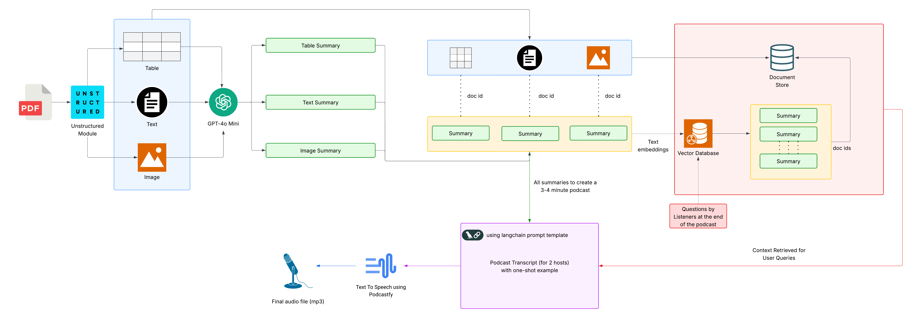

# 🎙️ Multimodal RAG – PDF to Podcast

**Podcastify you PDFs incorporating question from listeners.**



## 🧠 Overview

This generative AI pipeline converts PDFs—encompassing text, tables, and images—into natural-sounding podcast episodes. Leveraging a Multimodal RAG pipeline, it extracts and summarizes content, generates a two-host dialogue, and synthesizes audio for an immersive listening experience. It also uses RAG to incorporate questions from listeners (simulating) at the end of the podcast.

## 🚀 Features

* **Multimodal Content Extraction**: Processes text, tables, and images using the Unstructured module with a title-based strategy.
* **Semantic Search**: Employs Chroma DB and OpenAI embeddings for vectorization and retrieval of contextually relevant information.
* **Dialogue Generation**: Utilizes GPT-4o Mini to create summaries and generate a two-host podcast script, addressing potential listener questions.
* **Text-to-Speech Synthesis**: Integrates Google's NotebookLM-based TTS module, `podcastfy`, to produce realistic speech.

## 🧰 Tech Stack

* **LLMs**: GPT-4o
* **Prompt Framework**: LangChain
* **Embeddings & Vector Store**: OpenAI Embeddings, Chroma DB
* **Content Extraction**: Unstructured module
* **Text-to-Speech**: `podcastfy` (Google's NotebookLM-based TTS)


## ⚙️ Installation

1. **Clone the Repository**:

   ```bash
   git clone https://github.com/yourusername/multimodal-rag-pdf-to-podcast.git
   cd multimodal-rag-pdf-to-podcast
   ```

2. **Create a Virtual Environment**:

   ```bash
   python -m venv venv
   source venv/bin/activate  # On Windows: venv\Scripts\activate
   ```

3. **Install Dependencies**:

   ```bash
   pip install -r requirements.txt
   ```

4. **Set Up Environment Variables**:

   Create a `.env` file in the root directory and add your API keys:

   ```
   OPENAI_API_KEY=your_openai_api_key
   ```


## 📄 Sample PDF

You can test the application using the sample PDFs provided in the `data/pdfs/` directory.

## 🎙️ Generated Podcast Example
A example of podcast audio generated using this pipeline is provided in the `data/audio/` directory.


